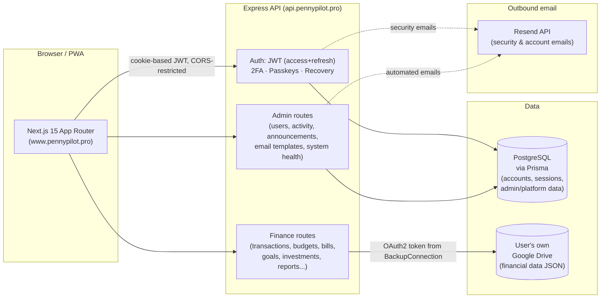

# Penny Pilot

**A personal finance dashboard for tracking income, expenses, budgets, bills, savings, and investments — with your own Google Drive as the data store.**

[](https://www.pennypilot.pro)
[](https://api.pennypilot.pro)
[]()
[](#license)

**Live:** [www.pennypilot.pro](https://www.pennypilot.pro) · **API:** `https://api.pennypilot.pro`

---

## 1. Overview

Penny Pilot is a full-stack personal finance web application. A signed-in user tracks their income, expenses, budgets, bills/EMIs, savings goals, and investments from a single dashboard, with analytics and reports built on top of that data. It ships as an installable PWA with a dedicated mobile UI, and includes a separate Super Admin/Admin console for operating the platform.

The distinguishing architectural choice: **a user's financial data lives in their own Google Drive**, not in Penny Pilot's database (unless they opt into a device-local mode instead). PostgreSQL holds accounts, sessions, and platform/admin data — never the transactions themselves for Drive-connected users.

## 2. What it does

- Record income and expense transactions, categorized and tagged to accounts/payment methods.
- Plan and track monthly budgets against actual spending.
- Track recurring bills/EMIs with due-date awareness.
- Set and monitor savings goals.
- Track an investment portfolio.
- View dashboard KPIs, income/expense trends, category breakdowns, and a financial health gauge.
- Generate analytics and exportable reports (CSV, Excel, JSON, PDF).
- Manage the account itself: profile, 2FA, passkeys, password/UID changes, session/security settings, notification preferences, and storage mode (Google Drive vs. local-only).

## 3. Core features currently implemented

| Area | Status |
|---|---|
| Income, expenses, transactions, accounts, categories | ✅ Implemented |
| Budgets | ✅ Implemented |
| Bills / EMIs | ✅ Implemented |
| Savings goals | ✅ Implemented |
| Investments | ✅ Implemented |
| Dashboard KPIs & charts | ✅ Implemented |
| Analytics & Reports | ✅ Implemented |
| Data export (CSV / Excel / JSON / PDF) | ✅ Implemented |
| Google Drive as primary data store | ✅ Implemented |
| "This device only" local storage mode | ✅ Implemented |
| Email/password auth + forced first-login password change | ✅ Implemented |
| Two-factor authentication (TOTP) | ✅ Implemented |
| Passkeys (WebAuthn) | ✅ Implemented |
| Account recovery (email OTP, TOTP, security questions) | ✅ Implemented |
| Session management & forced logout | ✅ Implemented |
| Admin / Super Admin console (users, activity, migration, announcements) | ✅ Implemented |
| Admin email template & automated-email management | ✅ Implemented |
| Notifications (in-app) | ✅ Implemented |
| Offline queueing & PWA install/update flow | ✅ Implemented |
| Responsive/mobile-specific UI (separate mobile views) | ✅ Implemented |
| Public SEO surface (`/`, `robots.txt`, `sitemap.xml`, `llms.txt`, OG/Twitter cards, JSON-LD) | ✅ Implemented |
| Voice greetings on login/signup/sign-out | ✅ Implemented (optional — silently disabled if unconfigured) |
| Consent PDF generation on signup | ✅ Implemented |

## 4. Architecture



- **Frontend and backend are separate deployments on separate origins** (`www.pennypilot.pro` / `api.pennypilot.pro`), talking over CORS-restricted, credentialed (cookie) HTTP requests.
- **Auth** is stateless JWT (access + refresh) in httpOnly cookies, with a server-side session table for revocation, inactivity expiry, and "force logout".
- **Financial data storage is per-user and pluggable**: Drive-connected users' transactions/budgets/etc. are read from and written to a `Penny Pilot` folder in their own Google Drive; PostgreSQL only stores the encrypted OAuth connection. Users who opt out of Drive use a "This Device Only" mode instead (data stays in the browser).
- **Admin/Super Admin** operations (user management, activity logs, announcements, email templates, platform settings, system health) are Postgres-backed and role-gated (`ADMIN` / `SUPER_ADMIN`), entirely separate from user financial data.

## 5. Technology stack

**Frontend**
- Next.js 15 (App Router), React 19, TypeScript
- Tailwind CSS
- TanStack Query, Zustand (state)
- React Hook Form + Zod (forms/validation)
- Framer Motion (animation)
- Recharts (charts)
- `@ducanh2912/next-pwa` (PWA/service worker)
- `@simplewebauthn/browser` (passkeys)

**Backend**
- Node.js, Express 5, TypeScript
- Prisma ORM + PostgreSQL
- `jsonwebtoken`, `bcryptjs`, `cookie-parser`, `helmet`, `express-rate-limit`
- `googleapis` (Google Drive OAuth + API)
- `@simplewebauthn/server` (passkeys)
- `otplib` (TOTP 2FA), `qrcode`
- `resend` (outbound email)
- `exceljs`, `pdfkit`, `archiver` (export formats)

## 6. Frontend structure

```
frontend/src/app/
├── (app)/                # Authenticated user shell — dashboard, expenses, income,
│                          # budget, bills, savings, goals, investments, analytics,
│                          # reports, notifications, profile, settings, transactions.
│                          # Server layout sets noindex,nofollow; client layout gates
│                          # on auth + Drive-connection state.
├── (admin)/admin/         # Authenticated admin shell — users, activity, announcements,
│                          # email templates, automated emails, integrations, migration,
│                          # settings, system-health, account. Server layout sets
│                          # noindex,nofollow; client layout gates on ADMIN/SUPER_ADMIN role.
├── page.tsx               # Public homepage ("/") — indexable, no auth check.
├── login/, signup/,
│   forgot-password/,
│   admin-login/           # Public auth pages.
├── setup-2fa/,
│   connect-drive/         # Post-auth onboarding steps.
├── terms/, privacy-policy/ # Public legal pages.
├── robots.ts, sitemap.ts  # Dynamic SEO endpoints.
```

Auth/session state lives in `lib/AuthContext.tsx` and `lib/SessionManager.tsx`; device detection (`lib/DeviceContext.tsx`, `lib/device.ts`) drives a fully separate mobile UI (`components/mobile/*`) rendered instead of the desktop sidebar/topbar layout on mobile user agents.

## 7. Authentication and security

- **Login**: email + password (bcrypt-hashed), issuing short-lived access + refresh JWTs as httpOnly, `SameSite=None` (cross-origin) cookies.
- **Forced first-login password change** for newly created accounts.
- **Two-factor authentication**: TOTP (`otplib`), with setup, verify, disable, and step-up re-verification for sensitive actions.
- **Passkeys**: full WebAuthn registration/authentication flow via `@simplewebauthn`.
- **Account recovery**: choice of email OTP, TOTP, or security questions; a dedicated `RecoverySession` model drives the multi-step reset flow.
- **Sessions**: server-side `Session` records back the JWTs, enabling inactivity-based expiry, per-session revocation, and admin-triggered forced logout.
- **CORS**: explicit origin allowlist (`APP_URL`/`FRONTEND_URL`), not a wildcard — required because credentialed cross-origin cookies make a permissive CORS policy exploitable.
- **CSRF defense-in-depth**: state-changing requests are rejected unless their `Origin` is on the same CORS allowlist.
- **Other hardening**: `helmet` security headers + CSP in production, per-route rate limiting (auth endpoints stricter than the API-wide baseline), consent PDF captured at signup, activity logging for security-relevant events.

## 8. Google Drive backup/storage architecture

Google Drive is the **primary persistent store for a user's financial data**, not a backup add-on:

- On first login, a `USER`-role account (unless it chose local-only storage) is guided through `/connect-drive`, an OAuth2 consent flow (`googleapis`).
- The resulting refresh token is encrypted at rest (`BACKUP_TOKEN_ENCRYPTION_KEY`) and stored in the `BackupConnection` model.
- All finance API routes (`transactions`, `budgets`, `dashboard`, `investments`, `bills`, `goals`, `savings`, `analytics`, `reports`, `settings`, `export`) are gated behind `requireDriveConnected` — for these routes, PostgreSQL is never the source of truth for the data itself.
- A dedicated `Penny Pilot` folder in the user's own Drive holds their data; the backend service layer (`services/drive/*`) handles the OAuth token refresh, folder bootstrap, and read/write operations.
- Users may instead choose **"This device only"** storage, keeping data in the browser and skipping Drive entirely.

## 9. Admin / Super Admin Command Center

A role-gated console (`ADMIN`, `SUPER_ADMIN`) separate from the user-facing app:

- User management (list, detail, create, force password reset, force UID reset, usage stats, entitlements, session listing/revocation, force logout).
- Activity log viewer and security-event summary.
- Platform announcements (create/publish/manage).
- Email template management with per-template overrides and a live "send test" action, plus toggles for the platform's automated emails (password reset, password changed, account updated, etc.).
- Platform settings.
- Migration status/summary tooling and on-demand Postgres backup.
- System health snapshot (database latency, whether email/Drive integrations are configured) — reports real measurements or `not_monitored`, never a fabricated status.

Admin authentication is fully separate from user authentication (`/admin-login`), and every admin route requires the `ADMIN`/`SUPER_ADMIN` role server-side (`requireRole` middleware) in addition to being `noindex,nofollow` on the frontend.

## 10. Responsive / mobile architecture

Rather than pure CSS responsiveness, mobile requests get a **dedicated component tree**: the server detects the user agent (`lib/device.ts`) and the authenticated shell (`(app)/AppShellLayoutClient.tsx`) renders `components/mobile/*` views (bottom-sheet forms, a mobile app bar/bottom nav, mobile-specific Analytics/Reports/Settings/Security/Storage/Notifications/2FA/Connect-Drive screens) instead of the desktop sidebar/topbar layout. The app is installable as a PWA (`@ducanh2912/next-pwa`), with an offline fallback page (`/~offline`), an update-available prompt, and an offline write queue (`lib/offlineQueue.ts`, `lib/offlineSync.ts`) that flushes once connectivity returns.

## 11. Email / recovery system

- Outbound email goes through **Resend**, with two independent clients/keys: one for user-facing account/security emails, one dedicated to super-admin notifications (new signups, admin-account security events) — configured via separate env vars so the two flows can't interfere with each other.
- **Security-critical** emails (password reset code, password changed, password reset by admin) always send, regardless of any automation toggle.
- Non-critical emails (e.g. "account updated by admin") can be toggled off per the platform's `EmailAutomationConfig`, and per-template content can be overridden by an admin via `EmailTemplateOverride` — both admin-manageable from the Command Center (§9).
- If no Resend API key is configured, email sending silently no-ops — the rest of the app is unaffected.
- Account recovery (forgot password) supports three verification paths: emailed OTP, existing TOTP device, or security questions — selectable per account depending on what the user has configured.

## 12. SEO / public website architecture

- **Public, indexable routes**: `/` (homepage), `/login`, `/signup`, `/forgot-password`, `/terms`, `/privacy-policy`.
- **Private, `noindex,nofollow` routes**: everything under the authenticated `(app)` and `(admin)` route groups, plus `/connect-drive`, `/setup-2fa`, `/admin-login`, `/403` — enforced both by `robots.txt` and by a page-level `robots` meta tag on the server layouts.
- **`/robots.txt` and `/sitemap.xml`** are generated dynamically (`app/robots.ts`, `app/sitemap.ts`) from a single canonical `SITE_URL` (`lib/siteUrl.ts`), defaulting to `https://www.pennypilot.pro`.
- **`/llms.txt`** gives AI crawlers a factual summary of the public product surface, explicitly excluding private/authenticated routes.
- **Open Graph / Twitter Card** metadata (title, description, `og-image.png`, `summary_large_image`) is set globally in the root layout and reused by every public page; `/login` additionally emits `Organization`/`SoftwareApplication` JSON-LD.
- **`api.pennypilot.pro`** (the backend) is a separate origin, not part of the frontend's SEO surface at all.

## 13. Local development setup

**Prerequisites:** Node.js 20+, PostgreSQL, npm.

```bash
# 1. Clone
git clone <repo-url>
cd personal-finance-dashboard-pro

# 2. Backend
cd backend
cp .env.example .env      # fill in values — see §14
npm install
npx prisma migrate dev
npm run dev                # http://localhost:4000

# 3. Frontend (new terminal)
cd frontend
cp .env.example .env.local
npm install
npm run dev                # http://localhost:3000
```

The frontend expects the backend at `NEXT_PUBLIC_API_URL` (defaults to `http://localhost:4000` if unset).

## 14. Environment variables

Names only — never commit actual secret values.

**Backend** (`backend/.env`)

| Variable | Purpose |
|---|---|
| `DATABASE_URL` | PostgreSQL connection string |
| `PORT` | API port (default `4000`) |
| `NODE_ENV` | `development` / `production` |
| `APP_URL`, `FRONTEND_URL` | Allowed frontend origin(s) — drives CORS, CSRF checks, email links |
| `JWT_ACCESS_SECRET`, `JWT_REFRESH_SECRET` | JWT signing secrets |
| `COOKIE_SECRET` | Cookie signing secret (required — server refuses to start without it) |
| `GOOGLE_CLIENT_ID`, `GOOGLE_CLIENT_SECRET`, `GOOGLE_REDIRECT_URI` | Google OAuth client for Drive integration |
| `BACKUP_TOKEN_ENCRYPTION_KEY` | Encrypts stored Google OAuth tokens at rest |
| `RESEND_API_KEY`, `RESEND_FROM_EMAIL` | User-facing outbound email (optional) |
| `SUPER_ADMIN_RESEND_API_KEY`, `SUPER_ADMIN_RESEND_FROM_EMAIL` | Super-admin-only outbound email (optional) |
| `GOOGLE_TTS_API_KEY` | Voice greetings (optional; feature silently disabled if unset) |

**Frontend** (`frontend/.env.local`)

| Variable | Purpose |
|---|---|
| `NEXT_PUBLIC_API_URL` | Backend API base URL |
| `NEXT_PUBLIC_APP_URL` | Canonical site URL for metadata/canonical/sitemap/robots/OG/JSON-LD (defaults to `https://www.pennypilot.pro`) |
| `NEXT_PUBLIC_GOOGLE_SITE_VERIFICATION` | Google Search Console verification (optional) |
| `NEXT_PUBLIC_BING_SITE_VERIFICATION` | Bing Webmaster Tools verification (optional) |

## 15. Database / Prisma setup

- **Provider**: PostgreSQL, accessed via Prisma Client.
- **Schema**: `backend/prisma/schema.prisma` — key models include `User`, `Session`, `UserEntitlement`, `Announcement`, `EmailTemplateOverride`, `EmailAutomationConfig`, `RecoverySession`, `SecurityQuestion`, `ConsentRecord`, `Passkey`, `BackupConnection`, `ActivityLog`, `AppSettings`, `AppProfile`, `PlatformSettings`, plus the finance domain models (`Category`, `Subcategory`, `Account`, `PaymentMethodType`, `Transaction`, `Budget`, `Investment`, `Bill`, `Goal`, `Notification`) — the latter used only for Local-Only-mode/admin data, since Drive-connected users' data lives in Drive, not Postgres.
- **Commands**: `npx prisma migrate dev` (development), `npx prisma migrate deploy` (production, run in the deploy step), `npx prisma studio` (inspect data), `npx prisma generate` (regenerate client — also runs automatically via `postinstall`).

## 16. Production / deployment architecture

| Component | Host | URL |
|---|---|---|
| Frontend (Next.js) | Vercel | `https://www.pennypilot.pro` (apex `pennypilot.pro` redirects to `www`) |
| Backend (Express API) | Render | `https://api.pennypilot.pro` |
| Database | Managed PostgreSQL | — |

- Frontend and backend deploy independently; `NEXT_PUBLIC_*` variables are build-time and require a redeploy after changing.
- CORS on the backend allows only the configured frontend origin(s) (`APP_URL`/`FRONTEND_URL`).
- `frontend/vercel.json` and `backend/vercel.json` exist in-repo; the backend's current production deployment target is Render (see `api.pennypilot.pro`'s DNS).

## 17. Project structure

```
personal-finance-dashboard-pro/
├── frontend/                 # Next.js 15 App Router app
│   ├── src/app/               # Routes (see §6)
│   ├── src/components/        # UI components (desktop, mobile, admin, seo, legal, ui)
│   ├── src/lib/                # Client-side auth, API client, storage, offline sync, etc.
│   └── public/                 # Static assets, PWA manifest/icons, og-image.png, llms.txt
├── backend/                  # Express API
│   ├── src/routes/            # One file per resource (auth, transactions, budget, admin, ...)
│   ├── src/middleware/        # authenticate, requireRole, requireDriveConnected, validation
│   ├── src/services/          # drive/, email/, export/, entitlements/, admin/, consent/
│   ├── src/lib/                # Shared server utilities (crypto, tokens, activity log, ...)
│   └── prisma/                 # schema.prisma, migrations
└── docs/                     # SEO_SETUP.md
```

## 18. Current verification/testing status

- No automated test suite (unit/integration/e2e) was found in either `frontend/` or `backend/`.
- Type safety is enforced via `tsc --noEmit` in both projects, and `next lint` in the frontend.
- Verification to date has been manual: production builds, `next lint`/`tsc`, and direct `curl`/browser checks of key flows (auth endpoints, SEO endpoints, CORS) against the live deployment.
- **Recommended next step for contributors:** add automated tests for the auth flows (login/2FA/passkey/recovery) and the Drive-backed finance routes, since these currently rely entirely on manual verification.

## 19. Production URLs

- Frontend: **https://www.pennypilot.pro**
- API: **https://api.pennypilot.pro**

## 20. Future improvements

Identifiable directly from the codebase's own comments/state, not speculative:

- Automated test coverage (see §18) — none currently exists.
- A dedicated Postgres-backup admin action exists (`POST /api/admin/backup`) alongside the Drive-per-user model; its long-term role alongside per-user Drive storage isn't fully documented in-code.
- Voice greetings and Google Search Console/Bing verification are both wired to be enabled purely via environment variables when the operator is ready — no code changes needed to turn them on.

---

## License

`backend/package.json` declares MIT. No `LICENSE` file is currently present at the repository root — add one to make this binding.
